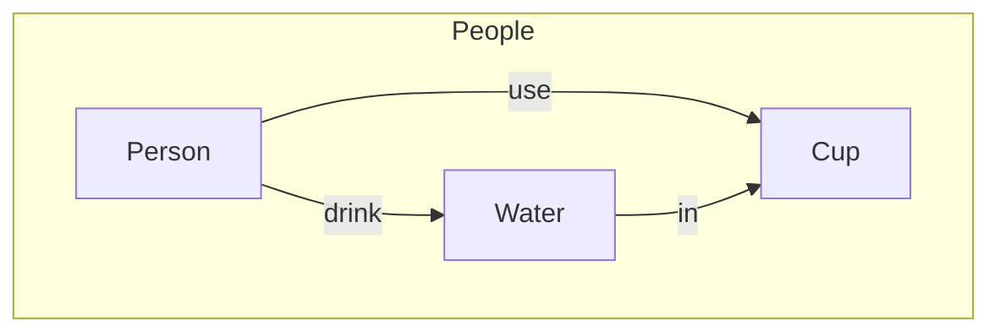

#Activity: drinking water.

#Objects: people(I), water, cup.

#Descripition: I pick up a cup filled with water and drink it off.

#Diagram:

```mermaid
graph TD
    subgraph People
        A[Person] -->|drink| B[Water]
        A -->|use| C[Cup]
        B[Water] -->|in| C
    end
```